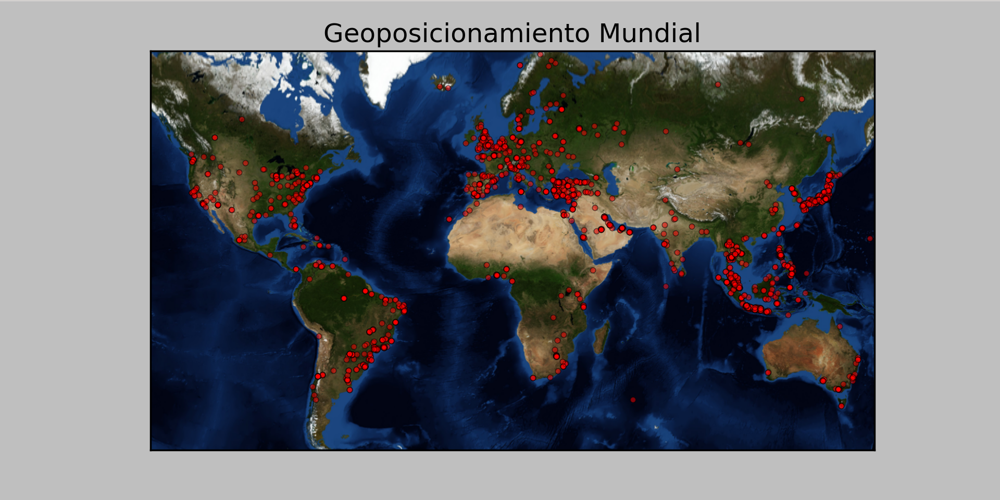
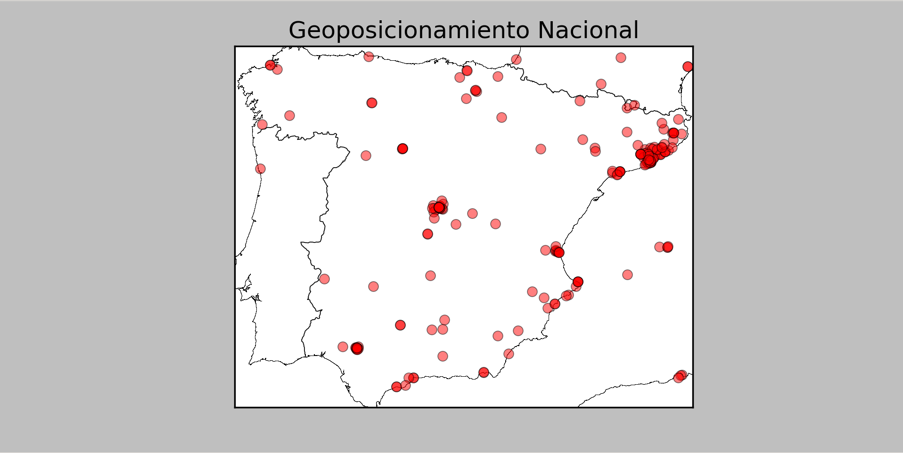

# [HARVEY](https://juanvelascogomez.github.io/harvey/)

## Cambios previstos (Sin fecha determinada)

## [FWHIBBIT](http://fwhibbit.github.io/) - [Blog](https://fwhibbit.es/)

[FWHIBBIT](http://fwhibbit.github.io/) es un grupo formado por una serie de amigos que estudian y trabajan sobre nuevas ideas en el ámbito de la ciberseguridad. Puedes seguir nuestro [blog](https://fwhibbit.es/) para más información.

## Menu del programa

1. Analizar un objetivo concreto. Basado en el proyecto [tweets_analyzer](https://github.com/x0rz/tweets_analyzer) del usuario de github [x0rz](https://github.com/x0rz).
2. Vigilancia digital en España utilizando streaming de tweets.
3. Vigilancia digital mundial basada en palabra clave utilizando streaming de tweets.
4. Geoposicionamiento a nivel mundial (sin filtro por palabra)
5. Geoposicionamiento a nivel nacional (sin filtro por palabra)

## Instalación repositorios (Debian)
    apt-get install python-pip git python-mpltoolkits.basema

    git clone https://github.com/juanvelascogomez/harvey.git

    cd harvey/

    pip install -r requirements.txt

## Uso del programa

Basta con lanzar el programa principal utilizando python2.

    python2 main.py

## Ejemplos gráficos

## Cómo contribuir

Si quereis colaborar desde github tenéis que:

  - En el repositorio original hacer un **fork** del repositorio, para tenerlo en vuestro perfil.
  - Hacer un git clone del repositorio que habeis hecho fork en vuestro ordenador.
  - Modificar lo que querais
  - Subirlo a vuestra cuenta (git push normal)
  - Desde github.com teneis que ir al repositorio vuestro y darle al botón "New pull request"
  - Y esperar a que desde esta cuenta de github se acepten los cambios.

## Copyright and License

GNU GENERAL PUBLIC LICENSE
